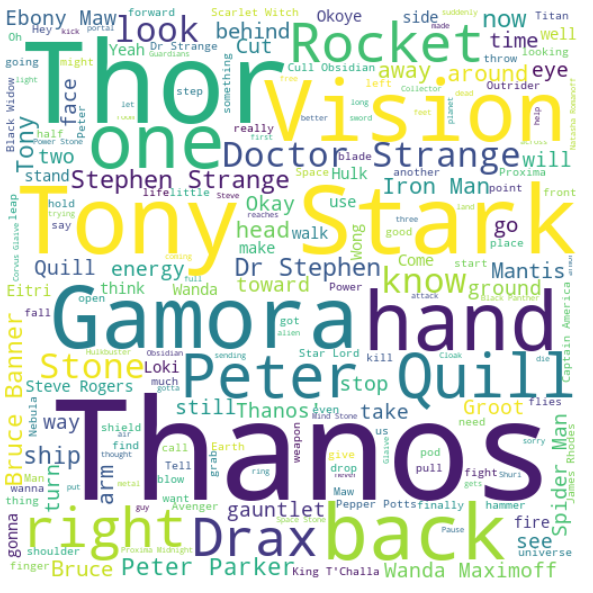
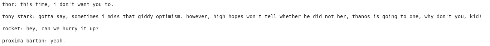

# NLP Workshop
This year, School of AI Algiers organizes the first edition of AI Day where participants can attend an NLP Workshop. This is the starter repository for all the attendees. The practice part of the workshop will aim to generate movie scripts using the scripts of Avengers : Infinity War and Avengers Endgame. 

Inspired by [Udacity Nanodegree Project of generating Seinfield TV Shows](https://www.udacity.com/). 

<p align="center">
  
</p>

### Generated Script Example  
Just trained for 50 epochs --> loss = 1.4 



# Folder Structure  
* aiday_movie_script_generation.ipynb : workshop notebook. 
* data : the folder containing avengers scripts (avengers_infinity.txt, avengers_endgame.txt) 

# Requirements 
Please be sure to bring your laptops and install the following tools : 
* Anaconda : Check out their website : https://docs.anaconda.com/anaconda/install/
* PyTorch : ```conda install pytorch torchvision -c pytorch``` (https://pytorch.org/) 
* Spacy : ```pip install spacy```
* en_core_web_md : ```!python3 -m spacy download en_core_web_md```
* WordCloud : ``` pip install wordcloud``` 

**You can directly install the environement with all the packages using the environment.yml file :** ``` conda env create -f environment.yml ```

NOTE : We will explain all these requirements during the workshop ;) 
